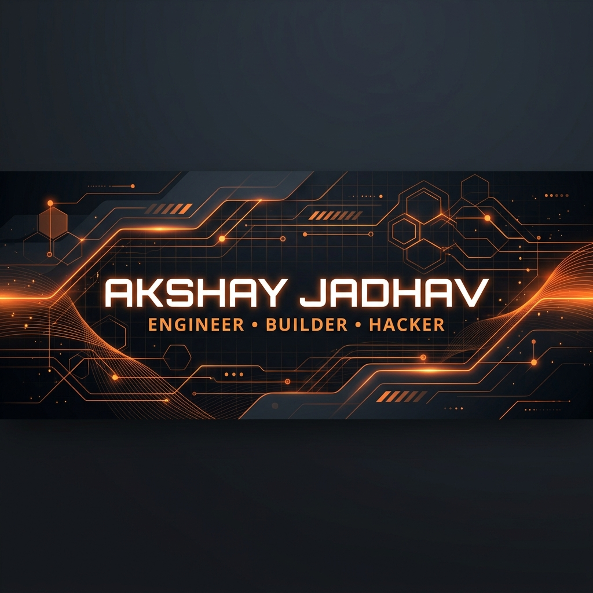

  

<h1 align="center">
  
</h1>

  
  
  

---

### 🚀 About Me

I'm an **18-year-old developer & hackathon competitor** based in Pune, India. I started building at 17, driven by competitive programming and the thrill of turning logic into production-ready software. I thrive in high-pressure environments like 48-hour hackathons, building AI pipelines, PWAs, and developer tools.

- 🎓 **Education:** B.Tech in Computer Engineering at **Pimpri Chinchwad University (PCU), Pune**.
- 🌐 **Community:** **Google ELP Core Member** (Pune region) & speaker at Google Developer Groups (GDG).
- 🏆 **Team:** Co-founder of **Bloodline.exe** — competing globally across MLH, Devpost, and hack2skill.
- 🏋️ **Routine:** DSA on Codeforces/LeetCode, gym by 7:15 AM, and building agentic AI workflows.

---

### 💻 Tech Stack

  

---

### 📂 Featured Projects

<table width="100%">
  <tr>
    <td width="50%" valign="top">
      <h4>⚡ <a href="https://github.com/akshayjadhav237237-cmd/DispatchAi">DispatchAI</a></h4>
      
Autonomous data pipeline orchestrator utilizing Gemini 1.5 Pro, Google Cloud Run, and Model Context Protocol (MCP) servers. Built for GCP Rapid Agent Hackathon.

      <code>Python</code> <code>Gemini API</code> <code>Cloud Run</code> <code>MCP</code>
    </td>
    <td width="50%" valign="top">
      <h4>🏥 <a href="https://github.com/akshayjadhav237237-cmd/Sanjeevani">Sanjeevani</a></h4>
      
AI health & wellness platform providing instant symptom analysis, health tracking metrics, and emergency responder alerts.

      <code>React</code> <code>Gemini API</code> <code>Supabase</code> <code>AI</code>
    </td>
  </tr>
  <tr>
    <td width="50%" valign="top">
      <h4>💳 <a href="https://github.com/akshayjadhav237237-cmd/spend-sense-v1.1">SpendSense</a></h4>
      
Smart progressive finance PWA. Migrated from offline localStorage to Supabase. Supports partial repayments and receipt scanning.

      <code>React</code> <code>Tailwind</code> <code>Supabase</code> <code>PWA</code>
    </td>
    <td width="50%" valign="top">
      <h4>🏛️ <a href="https://github.com/akshayjadhav237237-cmd/CivicaX">CivicaX</a></h4>
      
AI-powered smart governance & disaster response app with three core modules and a liquid glassmorphic UI.

      <code>React</code> <code>Framer Motion</code> <code>AI APIs</code> <code>Glassmorphism</code>
    </td>
  </tr>
</table>

---

### 🏆 Achievements

- **Top 10 & Excellence Award** at *ENNOVATE'X 2026* for pitching Grabit, a P2P camera rental platform.
- **Top 100 Finalist** globally in *PST × Replit* hackathon.
- **Top 15k Global Rank** in *Google Big Code 2026* coding challenge.
- GDG Speaker on NASA OSDR data analysis pipelines.

---

### 📊 Github Stats & Metrics

  

<table width="100%">
  <tr>
    <td width="50%" align="center" valign="top">
      
    </td>
    <td width="50%" align="center" valign="top">
      
    </td>
  </tr>
</table>

  

---

### 👾 Contributions Snake Game

This snake is eating my commits and updates every 12 hours automatically via GitHub Actions:

  <picture>
    <source media="(prefers-color-scheme: dark)" srcset="https://raw.githubusercontent.com/akshayjadhav237237-cmd/akshayjadhav237237-cmd/output/github-contribution-grid-snake-dark.svg">
    <source media="(prefers-color-scheme: light)" srcset="https://raw.githubusercontent.com/akshayjadhav237237-cmd/akshayjadhav237237-cmd/output/github-contribution-grid-snake.svg">
    
  </picture>

---

### 🌐 Connect With Me

  
  
  
  
  

